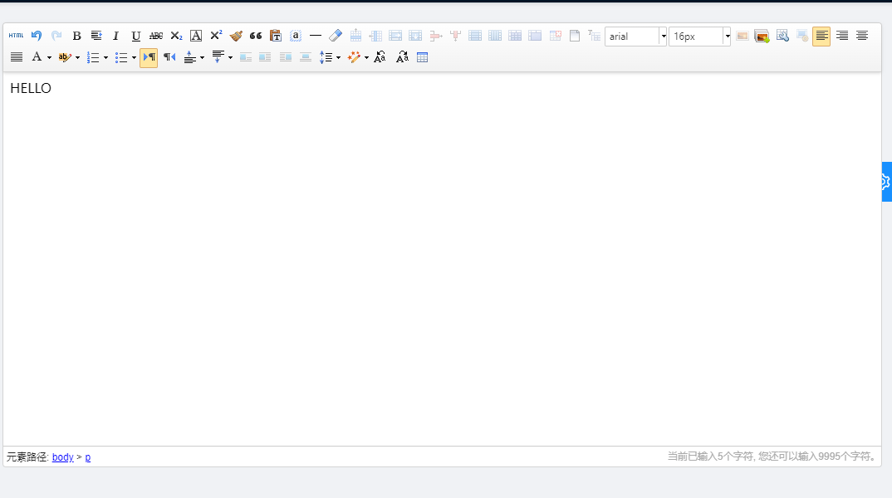

业务需要富文本能在源码和 markdown 中编辑，后续发现 Ueditor 可以做到，因此选择使用 Ueditor

<!--truncate-->

```js document.ejs配置
  <script type="text/javascript" src="<%= context.config.publicPath +'ueditor/ueditor.config.js'%>"></script>
  <script type="text/javascript" src="<%= context.config.publicPath +'ueditor/ueditor.all.js'%>"></script>
  <script type="text/javascript" src="<%= context.config.publicPath +'ueditor/lang/zh-cn/zh-cn.js'%>"></script>
  <script type="text/javascript" src="<%= context.config.publicPath +'ueditor/ueditor.parse.min.js'%>"></script>
```

:::tip ueditor github 地址
http://github.com/fex-team/ueditor
:::

1. 根据 github 说明，生成 dist 目录， 我是用默认方式，(跟说明文档一步一步走即可)

2. 将打包后的 dist 目录放在项目的 public 目录下，这里我将 dist 目录命名为 ueditor，在上方的 document.ejs 中也可以看到

3. 在 src/components 下新建文件夹，命名为 Ueditor

```js 组件代码
/**
 * @module 百度富文本编辑器
 * 自定义菜单配置
 */
import React, { Component } from "react";
let editor = null;

class UEditor extends Component {
  componentDidMount() {
    this.setConfig();
  }

  componentWillUnmount() {
    editor.destroy();
  }

  // 初始化编辑器
  setConfig() {
    editor = window.UE.getEditor("editor", {
      toolbars: [
        [
          "source", // 源代码
          // 'anchor', // 锚点
          "undo", // 撤销
          "redo", // 重做
          "bold", // 加粗
          "indent", // 首行缩进
          // 'snapscreen', // 截图
          "italic", // 斜体
          "underline", // 下划线
          "strikethrough", // 删除线
          "subscript", // 下标
          "fontborder", // 字符边框
          "superscript", // 上标
          "formatmatch", // 格式刷
          "blockquote", // 引用
          "pasteplain", // 纯文本粘贴模式
          "selectall", // 全选
          // 'print', // 打印
          // 'preview', // 预览
          "horizontal", // 分隔线
          "removeformat", // 清除格式
          // 'time', // 时间
          // 'date', // 日期
          // 'unlink', // 取消链接
          "insertrow", // 前插入行
          "insertcol", // 前插入列
          "mergeright", // 右合并单元格
          "mergedown", // 下合并单元格
          "deleterow", // 删除行
          "deletecol", // 删除列
          "splittorows", // 拆分成行
          "splittocols", // 拆分成列
          "splittocells", // 完全拆分单元格
          "deletecaption", // 删除表格标题
          "inserttitle", // 插入标题
          "mergecells", // 合并多个单元格
          "deletetable", // 删除表格
          "cleardoc", // 清空文档
          "insertparagraphbeforetable", // "表格前插入行"
          // 'insertcode', // 代码语言
          "fontfamily", // 字体
          "fontsize", // 字号
          // 'paragraph', // 段落格式
          "simpleupload", // 单图上传
          "insertimage", // 多图上传
          "edittable", // 表格属性
          "edittd", // 单元格属性
          // 'link', // 超链接
          // 'emotion', // 表情
          // 'spechars', // 特殊字符
          // 'searchreplace', // 查询替换
          // 'map', // Baidu地图
          // 'gmap', // Google地图
          // 'insertvideo', // 视频
          // 'help', // 帮助
          "justifyleft", // 居左对齐
          "justifyright", // 居右对齐
          "justifycenter", // 居中对齐
          "justifyjustify", // 两端对齐
          "forecolor", // 字体颜色
          "backcolor", // 背景色
          "insertorderedlist", // 有序列表
          "insertunorderedlist", // 无序列表
          // 'fullscreen', // 全屏
          "directionalityltr", // 从左向右输入
          "directionalityrtl", // 从右向左输入
          "rowspacingtop", // 段前距
          "rowspacingbottom", // 段后距
          // 'pagebreak', // 分页
          // 'insertframe', // 插入Iframe
          "imagenone", // 默认
          "imageleft", // 左浮动
          "imageright", // 右浮动
          // 'attachment', // 附件
          "imagecenter", // 居中
          // 'wordimage', // 图片转存
          "lineheight", // 行间距
          // 'edittip ', // 编辑提示
          // 'customstyle', // 自定义标题
          "autotypeset", // 自动排版
          // 'webapp', // 百度应用
          "touppercase", // 字母大写
          "tolowercase", // 字母小写
          // 'background', // 背景
          // 'template', // 模板
          // 'scrawl', // 涂鸦
          // 'music', // 音乐
          "inserttable", // 插入表格
          // 'drafts', // 从草稿箱加载
          // 'charts', // 图表
        ],
      ],
      enableAutoSave: false,
      autoHeightEnabled: false,
      initialFrameHeight: 450,
      initialFrameWidth: "100%",
      zIndex: 1200,
    });
    editor.ready(() => {
      editor.setContent(this.props.initData);
    });
  }

  // 获取编辑器内容
  getUEContent() {
    return editor.getContent();
  }

  render() {
    return <script id="editor" type="text/plain" />;
  }
}

export default UEditor;
```

4. 在其他组件中使用

```js
const [initData, setInitData] = useState('')
 <UEditor initData={initData} />
```

5. 最终效果



6. 其他问题

2022-07-15 使用发现无法获取到输入后的内容，

后边更改 Ueditor 组件为

```js 将getUEContent 方法设置为静态方法
  static getUEContent() {
    return editor.getContent();
  }
```

组件调用 UEditor.getContent() 即可获得输入内容
