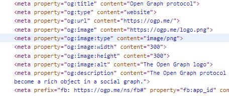

:::tip 开放图谱协议

[开放图谱协议](https://ogp.me/)

Open Graph Protocol（开放图谱协议），简称 OG 协议

:::

这个协议的作用在于，如果没有使用 OG 协议，将你的网站发送给其他人时，就只展示一个网络链接，效果如下

<!--truncate-->

在使用 OG 协议后，发送的链接形式如下，

> 可以检查 OG 网站的源代码，也可以看到它在 meta 上添加了 og 属性
> 
